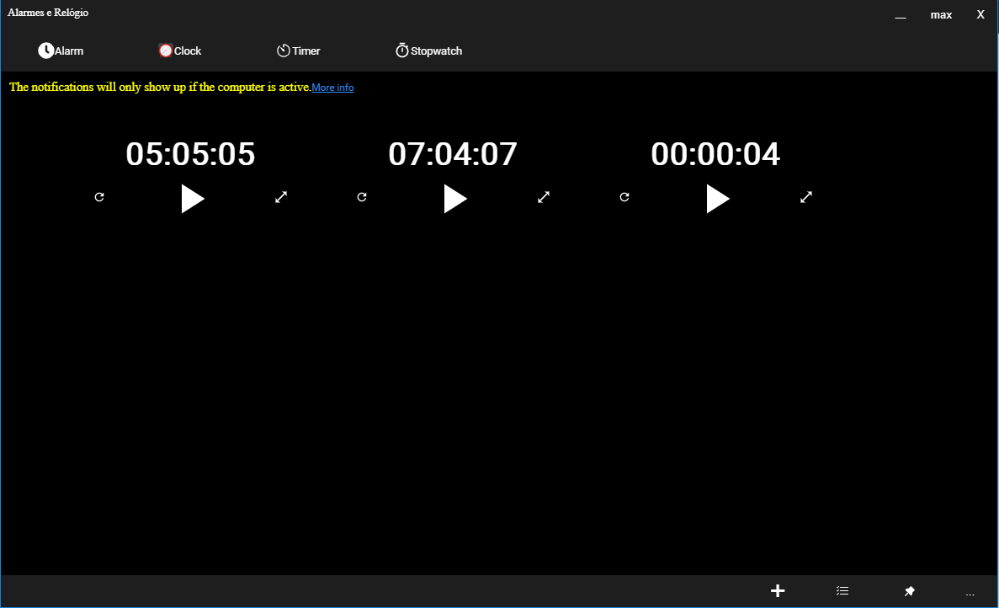

<h4 align="center">
	
</h4>

<h1 align="center">
 Microsoft Clone Alarm
</h1>

Its a recriation of the Microsoft Windows Alarm using React.

Was used the following technologies:
 - [React](https://reactjs.org)
 - [Node](https://nodejs.org/en/)
 - [Electron](https://www.electronjs.org/)

<p>
 
</p>

## Installation
Use this command in the terminal
```
git clone https://github.com/craftsmaker/microsoft-alarm-clone.git
```
Enter in the resulted folder and use these commands:
```
yarn install
yarn start
```
ou
```
npm i
npm start
```

## License
[MIT](LICENSE)
